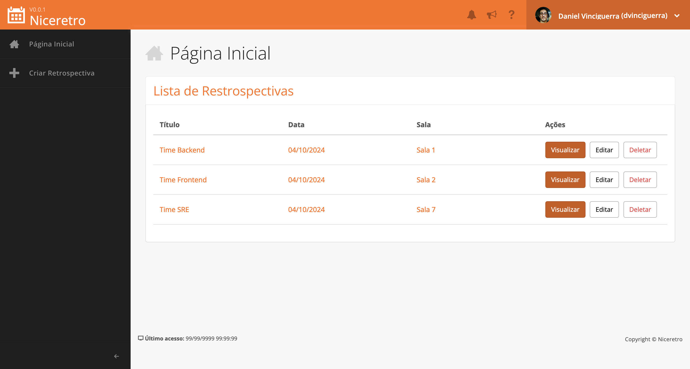

# NiceRetro

A simple Rails Application to manage agile retrospectives easily.

It was created by [souopablosilva](https://github.com/souopablosilva) for study purposes and I created this fork to keep the project updated and to add new features.

## Author

Originally created by [souopablosilva](https://github.com/souopablosilva).

Current maintainer of this fork, Daniel Vinciguerra.
